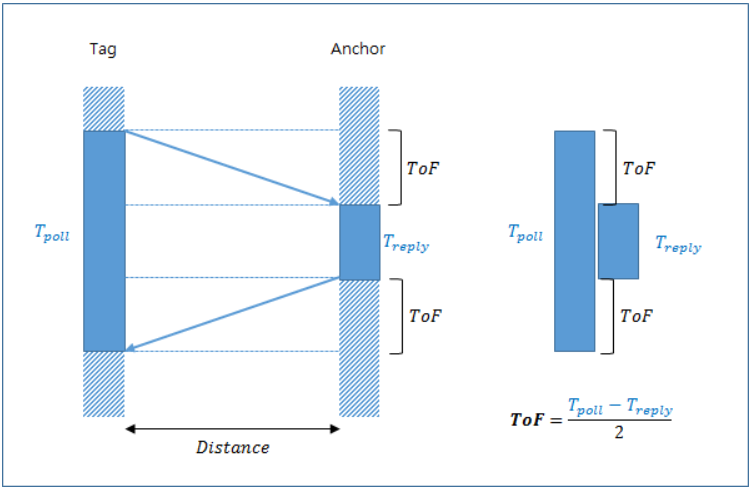

# Handle
Author: 김영래, 김태환

Date(Latest): 2024-05-23

요약: 시각장애인을 위한 손잡이(조작기) SW 개발

<br><br>

## 목록
- [1. 들어가기 앞서](#1-들어가기-앞서)

- [2. Handle 제작도 및 제작품](#2-handle-제작도-및-제작품)

- [3. 하드웨어 구성](#3-하드웨어-구성)

- [4. 기술 스택(SW)](#4-기술-스택sw)

- [5. Handle 폴더 구조](#5-handle-폴더-구조)

- [6. 기술 정리 및 설명](#6-기술-정리-및-설명)
    - [6-1. 참고 사항](#6-1-참고-사항)
    - [6-2. 거리 측정](#6-2-거리-측정)
    - [6-3. 사용자 속도 방향 측정](#6-3-사용자-속도-방향-측정)
    - [6-4. 목적지 입력](#6-4-목적지-입력)
    - [6-5. 이동방향 안내](#6-5-이동방향-안내)
    - [6-6. 통신 bluetooth](#6-6-통신-bluetooth)
    - [6-6-1. 세마포](#6-6-1-semaphore)
    - [6-7. FreeRTOS](#6-7-freertos)
    - [6-8. Interrupt](#6-8-interrupt)

- [7. 이슈 사항](#7-이슈-사항)


<br><br>

## 1. 들어가기 앞서

***손잡이를 만들게 된 이유***

안내 로봇과 함께 시각 장애인이 실내를 이동하는데 큰 어려움이 없도록 손잡이(조작기)를 만들었습니다.

<br><br>

## 2. Handle 제작도 및 제작품


<br><br>

## 3. 하드웨어 구성

보드: ESP32 (풀네임: ESP WROOM-32) 3개

UWB(DWM1000), IMU(MPU9250), Servo motor(MG996R), Button(없음)

<br><br>

## 4. 기술 스택(SW)
```
RTOS: FreeRTOS
WatchDog
Json <-> String Parsing
Bluetooth
PWM (Phase Width Modulation)
Qt (PySide6)
ROS2
기타 임베디드 스킬(GPIO, Interrupt, Uart, I2C, SPI 등등)
```

<br><br>

## 5. Handle 폴더 구조
```
Handle
|
├─development               // 실제 시연에서 사용된 코드들입니다.
│  ├─ESP_UWB_STR_WATCHDOG   // UWB Tag 코드입니다.
│  ├─Initator               // UWB Anchor 코드입니다.
│  └─TotalCode_STR          // IMU, Servo Motor, Bluetooth, Button 코드입니다.
|
|
├─Feature_test              // 개발을 위한 기능 개발 코드들 입니다.
│  ├─ESP_code
│  │  ├─blooth
│  │  ├─BlueAndUwb
│  │  ├─BlueAndUwbAndJson
│  │  ├─BlueAndUwbAndJson2
│  │  ├─bluetooth
│  │  ├─bluetooth_Li
│  │  │  └─bluetooth
│  │  ├─Blue_Uwb_Mpu_Json
│  │  ├─Blue_Uwb_Mpu_Json2
│  │  ├─Blue_Uwb_Mpu_Json_Servo
│  │  ├─extern_Lib
│  │  │  └─main
│  │  ├─FreeRTOS_ESP
│  │  ├─JsonFormat
│  │  ├─JsonFormat2
│  │  ├─MPU9250
│  │  ├─Servoring
│  │  ├─tasking
│  │  │  └─semaphore
│  │  └─UWB_Thread
│  └─python_code
│      ├─bluetooth
│      └─Json
└─img
```

<br><br>

## 6. 기술 정리 및 설명

### 6-1. 참고 사항

---

총 3개의 ESP32를 사용하기 떄문에 문서 이해에 어려움이 있습니다.
따라서 ESP32 마다 별칭을 만들었습니다.

- ESP32_Total   : UWB 기능을 제외한 나머지를 구동하는 ESP32입니다.
- ESP32_Tag     : UWB의 Tag 기능을 구동하며, distance 값을 ESP32_Total에게 Uart로 전달합니다.
- ESP32_Anchor  : UWB의 Anchor 기능을 구동합니다.

<br><br>

### 6-2. 거리 측정

---




이미지 출처: https://infograph.tistory.com/214

그림과 같이 **전자기파**의 이동시간을 통해 거리를 측정합니다.

```markdown
***목적***

측정된 거리는 블루투스 통신으로 안내 로봇에게 전달합니다. 거리는 시각장애인의 정확한 위치 판단(추측)에 이용됩니다.
```

ESP32_Total과 ESP32_Tag을 UART로 연결합니다. 

UART를 통해 distance 값을 ESP32_Tag -> ESP32_Total 전달합니다.

multi tasking을 이용해 uart의 메세지 큐의 가장 최신 distance 값을 가져옵니다.

(uart통신의 수신은 인터럽트를 사용하기 힘듭니다. RX pin을 인터럽트로 받기 때문에 bit마다 인터럽트가 발생합니다. 따라서 인터럽트 오버플로우가 발생할 가능성이 큽니다)

사용한 라이브러리의 한계(가끔 Anchor의 Respond가 정상적이지 않아 무한루프가 되는 이슈가 있음)로 **WatchDog**를 사용했습니다.
**WatchDog**은 **FreeRTOS**의 기능으로 Task가 정상 작동하는지 감시하는 기능입니다. (***ESP***-***IDF FreeRTOS*** is a ***FreeRTOS*** implementation based on Vanilla ***FreeRTOS*** v10.5.1)
WatchDog은 일종의 타이머(Timer)로 타겟 Task에 N초 이상 타이머 Reset을 하지 않으면(N초 → 0초로 줄어듭니다. 타이머를 Reset하면 다시 N초가 됩니다) 보드 자체를 Reset합니다.

<br><br>

### 6-3. 사용자 속도, 방향 측정

---


```markdown
***목적***

MPU9250(IMU)에는 9축(gyro, acc, mag)의 값을 I2C 통신으로 값을 읽어옵니다.
우리는 이 값들을 입력으로 Madgwick(매드윅)필터를 거쳐 시각장애인의 위치 변화를 예측합니다.
```

ESP32_Total과 연결됩니다.

FreeRTOS의 Multi-Tasking을 이용해 주기적으로 변화를 측정합니다.

측정된 값들은 로봇에게 블루투스로 전달합니다.

<br><br>

### 6-4. 목적지 입력

---


```markdown
***목적***

시각장애인이 건물 내 방문할 목적지와 혹시 이용할 목적지(화장실 등)의 위치로 이동하는 경우 안내 로봇에게 명령을 하기 위해 사용됩니다.
```

ESP32_Total의 GPIO와 버튼을 연결합니다.

ESP32_Total의 GND와 버튼의 반대쪽 핀을 연결합니다.

ESP32의 내부 PULL-UP(저항)모드를 이용해 회로를 간단하게 구성합니다.

인터럽트로 눌림을 감지합니다.

<br><br>

### 6-5. 이동방향 안내

---

```markdown
***목적***

안내 로봇이 앞서 나가면서 시각장애인이 안전히 이동 가능하도록 
이동 방향을 촉각 정보로 전달합니다.
전방을 90도로 하며, 左는 0도, 右는 180도입니다. 
```

시각장애인에게 진행할 방향에 대해 안내하기 위해 서보모터(MG996R)의 각도를 제어합니다.

MG996R를 위한 PWM(펄스 폭 변조)신호의 동작 주기인 20us에서 듀티사이클을 조작해 각도를 제어합니다.

각도는 로봇으로 부터 블.루투스로 0~180의 정수값으로 받아옵니다.

<br><br>

### 6-6. 통신 (Bluetooth)

---

```markdown
***목적***

안내 로봇과 통신을 위해 사용합니다.
IMU, UWB, Button의 정보를 시간과 함께 송신하고 
이동 방향의 정보를 가지는 Servo Motor의 회전각을 수신 받습니다. 
```

ESP32에는 블루투스 4.2 모듈(BLE-Bluetooth Low Energy 아님)이 내장되어 있습니다.

乙의 블루투스 모듈을 이용해, 로봇(Jetson nano)의 ac-8265 모듈과 통신합니다.

통신에는 송신과 수신이 있습니다. 

Json포맷을 String으로 변경해서 송신합니다. Json의 끝을 알리기 위해 ‘@’을 문자열을 전부 보내고 추가로 보냅니다. (’{’와 ‘}’의 갯수 비교보다 훨씬 간단함)

수신도 마찬가지로 ‘@’를 기준으로 문자열의 끝을 판단합니다.

수신은 인터럽트 방식을 사용하는데, UART와 달리 byte단위로 인터럽트가 걸리기 때문에 문제가 없습니다. (물론, 상대측의 송신이 매우 빠르면 수용 가능한 인터럽트 중첩 수보다 많아져서 보드가 reset됩니다)

‘@’를 만나면 수신한 문자열을 Json으로 파싱하고, 전역변수를 업데이트하는 Task에게 Semaphore를 Give합니다.

<br>

#### 6-6-1. Semaphore

(Semaphore를 사용하는 이유; Task는 multi tasking이기 때문에 일정 시간마다 읽는데 문자열을 다 받기 전에 읽으면 위험하다. 즉, 동기화를 해야만 한다. 이 동기화를 위해 Semaphore를 사용한다.) (Take와 Give가 있다. 만약 semaphore가 없는데 Take하면, 누군가 semaphore를 Give할 때 까지 대기한다.)

(일상 생활의 예시: 배고픈 나라의 밀가루 제분과 빵 굽기. 배고픈 나라에서 사람들에게 빵을 만들고자 한다. 밀가루 제분과 빵 굽기를 해야하는데 두 일을 동시에 하지 못하며, 최대한 빨리 배고픔을 해소시키기 위해 빵 굽는게 더 우선시 된다. 하지만 밀가루가 없으면 빵을 못 만든다. 이런 경우 세마포를 사용한다)

송신과 수신은 둘 다 멀티 태스킹을 이용한다.

<br><br>

### 6-7. FreeRTOS

---

```Markdown
***목적***

Multi Tasking: Task마다 먼저 진행할 우선순위가 있습니다. 이를 위해 멀티 태스킹을 사용합니다.

Semaphore: 동일한 자원을 사용하는 경우 멀티 태스킹에 의해 같이 접근함으로서 문제가 생길 수 있습니다. 자세한 내용은 "6-6-1. Semaphore" 를 참고해주세요.

WatchDog: 임베디드 특성상 시스템의 높은 신뢰성을 요구합니다. 이를 위해 비정상적인 작동을 하면 다시 부팅하는 절차를 밟습니다.


***안 쓰면 벌어지는 일***

기존의 절차지향 코드는 우선순위와 상관없이 앞의 내용을 끝내야 뒷 내용을 진행하는데, 이러면 일의 우선도에 상관없이 진행된다.
이러면 정작 중요한 일을 해야할 시기에 다른 작업들을 다 해야한다.

이를 위해 FreeRTOS를 사용하는데, 각 Task마다 우선순위를 지정해 우선순위가 높은 Task를 먼저 수행하도록 한다.
```

```C
// Multi Tasking 구현 방법

void Task(void *param) { // Task 생성
  for(;;) {
    // 작업 추가
    vTaskDelay(500);
  }

  vTaskDelete(); // 무한루프면 없어도 동작함
}

// xTaskCreate(Task, "Task별명", 스택 사이즈, param, 우선순위, pxCreatedTask);

void main() {
    xTaskCreate(Task, "Task", 2048, NULL, 1, NULL);
}


// --------------------------------------------------------------------------


// Semaphore 구현 방법

SemaphoreHandle_t semaphore_b; // 세마포 변수 생성


void TaskOrISR() {
    xSemaphoreGive(rx_semaphore_b); // 세마포 할당
}


void Task(void *param) {
    if(xSemaphoreTake(rx_semaphore_b, portMAX_DELAY) == pdTRUE) { // 세마포 take 및 대기
        // 작업
    }
}


void main() {
    semaphore_b = xSemaphoreCreateBinary(); // 바이너리로 지정
}


// -------------------------------------------------------------------------


// WatchDog 구현 방법

void main() {
    esp_task_wdt_init(10, true); // 데드라인 10초로 지정
    esp_task_wdt_add(NULL);  // 대상 지정
}


void Task(void *param) {
    for(;;) {
        // ...
        esp_task_wdt_reset(); // 타이머 리셋
        // ...
    }
}
```

<br><br>

### 6-8. Interrupt

---

```markdown
***목적***

1. 더 빠른 반응을 위해 사용한다. 
2. 폴링 방식 보다 더 적은 리소스 사용을 위해 사용한다.


***안 쓰면 벌어지는 일***

만약 인터럽트를 사용하지 않으면 버튼을 눌렀는지 계속 지켜보고 있어야 한다. (이를 폴링 방식이라 한다) 이는 매우 비효율적이며, 계속 지켜보고 있어야 하기 때문에 다른 작업을 수행하지 못하고, 멀티태스킹을 이용한다고 해도, 정작 지켜보는 태스크가 수행을 안 하고 있으면 놓친다.


```

```c
// 블루투스 인터럽트 구현 방법

BluetoothSerial SerialBT;

void rxInterrupt(esp_spp_cb_event_t event, esp_spp_cb_param_t *param) {
  if (event == ESP_SPP_DATA_IND_EVT) { 
    while(SerialBT.available()) {
      // ...
    }
  }
}

void main() {
    SerialBT.register_callback(rxInterrupt);
}
```


<br><br>

## 7. 이슈 사항

TODO
UART 인터럽트 방식